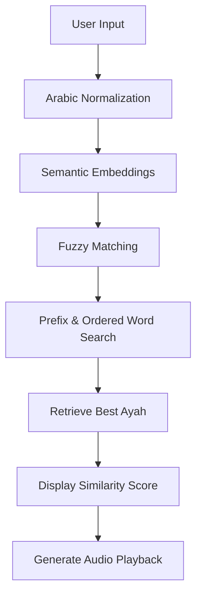

<div align="center">

# 🕌 Quran Ayah Correction & Retrieval System
### AI-Powered Arabic NLP Engine for Quranic Verse Search, Correction, and Audio Retrieval


</div>

---

# 📖 Overview

This project is an intelligent **Arabic NLP retrieval system** designed to help users find the correct Quranic ayah from:

- Incomplete verses
- Unvowelled Arabic text
- Slight spelling mistakes
- Partial phrases
- First words of an ayah

The system does **NOT generate Quranic text**.

Instead, it retrieves authentic ayahs directly from a verified Quran dataset using a hybrid retrieval pipeline combining:

- Semantic Search
- Fuzzy Matching
- Prefix Matching
- Ordered Word Matching

The application also supports:

✅ Audio recitation playback  
✅ Similarity scoring  
✅ Alternative ayah suggestions  
✅ Fast Quranic search  

---

# ✨ Features

## 🔍 Intelligent Quran Retrieval
Searches across all **6236 Quranic ayahs** using semantic similarity and fuzzy matching.

## 🧠 Arabic NLP Preprocessing
Normalizes Arabic text by:
- Removing diacritics
- Normalizing Alef forms
- Removing tatweel
- Handling hamza variations
- Cleaning extra spaces and symbols

## ⚡ Typo-Tolerant Matching
Handles spelling mistakes and partial inputs.

### Example

#### User Input

```text
الحمد لله رب العلمين
```

#### Retrieved Ayah

```text
ٱلْحَمْدُ لِلَّهِ رَبِّ ٱلْعَٰلَمِينَ
```

#### Output

```text
Surah: الفاتحة
Ayah: 2
Similarity Score: 97%
```

---

# 🔊 Audio Recitation

The system automatically generates audio playback for retrieved ayahs using Quran audio CDN integration.

### Audio Source

```text
https://cdn.islamic.network/quran/audio/128/ar.alafasy/{ayah_no_quran}.mp3
```

---

# 🧠 Retrieval Pipeline



---

# 🛠 Technologies Used

| Technology | Purpose |
|---|---|
| Python | Core Development |
| Streamlit | Web Interface |
| Sentence Transformers | Semantic Search |
| Hugging Face | Embedding Models |
| RapidFuzz | Fuzzy Matching |
| Pandas | Data Processing |
| NumPy | Numerical Operations |
| Matplotlib | Evaluation Visualization |

---

# 🤖 Model

### Default Embedding Model

```text
sentence-transformers/paraphrase-multilingual-MiniLM-L12-v2
```

The final retrieval system combines:

- Hugging Face Embeddings
- RapidFuzz Matching
- Exact Matching
- Prefix Search
- Ordered Word Matching

This hybrid architecture significantly improves retrieval quality for Arabic Quranic text.

---

# 📊 Evaluation Results

The system was evaluated on **150 generated test cases** covering:

- Full ayahs without diacritics
- First phrase retrieval
- Middle phrase retrieval
- Typo correction

---

## 📈 Overall Performance

| Metric | Score |
|---|---|
| Top-1 Accuracy | 91.33% |
| Recall@5 | 94.67% |
| MRR | 92.63% |
| Mean Rank | 1.07 |
| nDCG@5 | 93.14% |

---

## 📌 Results by Query Type

| Query Type | Accuracy |
|---|---|
| First Phrase | 100% |
| Full Ayah | 97.96% |
| Middle Phrase | 100% |
| Typo Phrase | 72.73% |

The typo category is the most challenging because queries intentionally contain spelling mistakes.

---

# 📂 Project Structure

```bash
quran-chatbot/
│
├── app.py
├── matcher.py
├── preprocessing.py
├── requirements.txt
├── README.md
│
├── data/
│   └── quran.csv
│
├── evaluation/
│   ├── expanded_test_cases.csv
│   ├── expanded_evaluation_summary.csv
│   └── expanded_evaluation_by_type.csv
│
└── scripts/
```

---

# ⚙️ Installation

## Clone Repository

```bash
git clone https://github.com/Mo22afa/quran-chatbot.git
cd quran-chatbot
```

## Install Dependencies

```bash
pip install -r requirements.txt
```

---

# ▶️ Run The Application

```bash
streamlit run app.py
```

Open:

```text
http://localhost:8501
```

---

# 🧪 Usage Examples

## Example 1

### Input

```text
ان اعطيماك الكوثر
```

### Output

```text
إِنَّآ أَعْطَيْنَٰكَ ٱلْكَوْثَرَ

Surah: الكوثر
Ayah: 1
```

---

## Example 2

### Input

```text
ربي انهن اظللن كثيرا من الناس
```

### Output

```text
رَبِّ إِنَّهُنَّ أَضْلَلْنَ كَثِيرًا مِّنَ ٱلنَّاسِ

Surah: ابراهيم
Ayah: 36
```

---

# 🔒 Safety Note

This project does not use generative AI to create or modify Quranic verses.

All returned ayahs are retrieved directly from a verified Quran dataset.

---

# 🚀 Future Improvements

- 🎤 Speech-to-Text Input
- 📱 Mobile-Friendly Interface
- ⚡ Faster Vector Search
- 🤖 Transformer Fine-Tuning
- 🌐 REST API Deployment
- 🔍 Word-Level Error Highlighting
- 📥 Offline Audio Support

---

# 👨‍💻 Author

## Mostafa Abdelwahab

AI & Data Science Enthusiast focused on:

- Arabic NLP
- Information Retrieval
- Machine Learning
- Intelligent Search Systems

---

<div align="center">

# ⭐ If you like this project, give it a star!

### 🔗 Repository
https://github.com/Mo22afa/quran-chatbot

</div>
